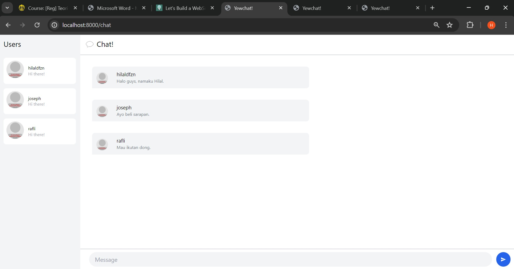

# **Rust Tutorial & Exercise**
**Muhammad Hilal Darul Fauzan** 
**2206830542** 
**Pemrograman Lanjut C** 

## **Tutorial Modul 10: Asynchronous Programming**

### 3.1. Original code

Link github Simple WebSocket Server: https://github.com/jtordgeman/SimpleWebsocketServer

Link github YewChat: https://github.com/jtordgeman/YewChat

Setelah melakukan clone pada kedua repository, maka kita dapat melakukan interaksi antar page dengan memasukkan username. Hasilnya seperti foto di bawah ini, di mana terdapat tiga user yang melakukan chat bersama.

